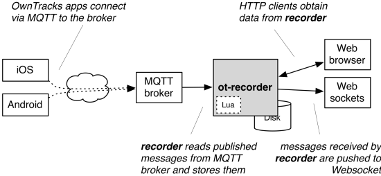
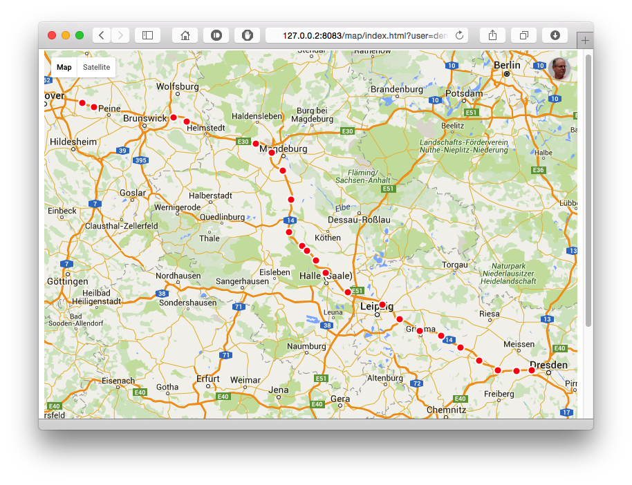
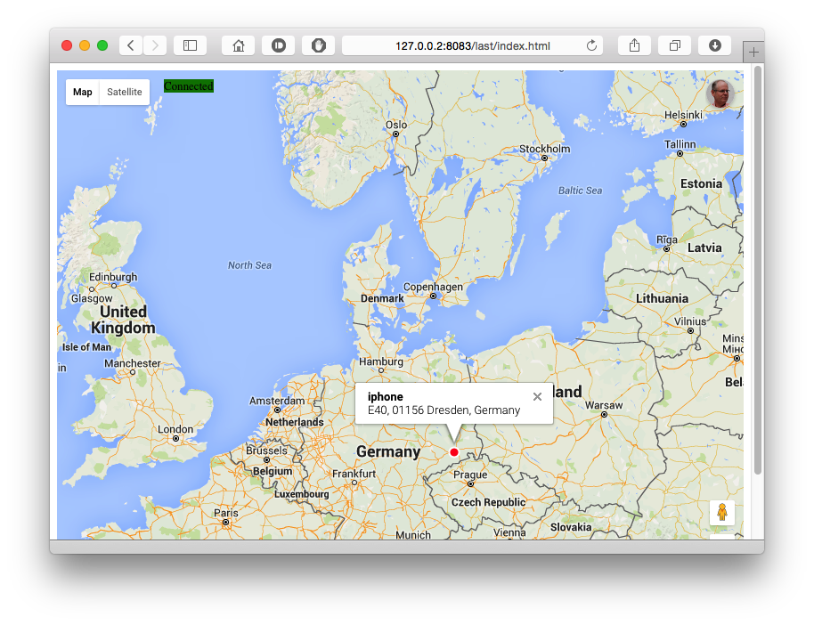
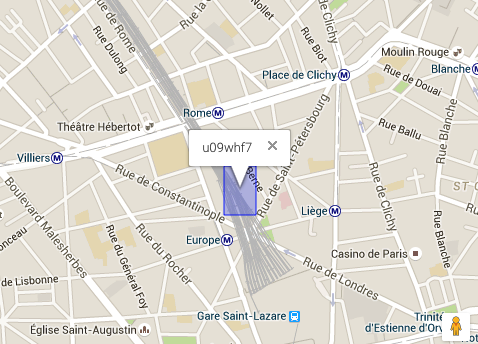
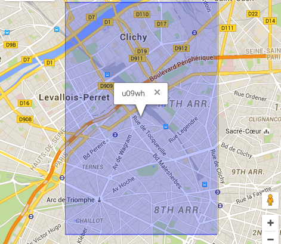
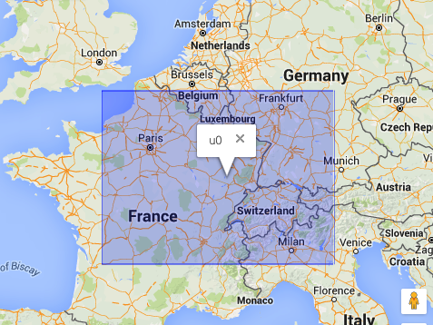
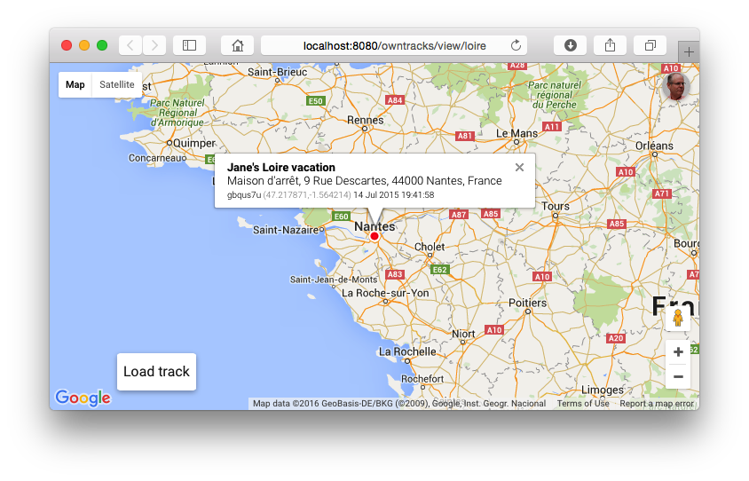
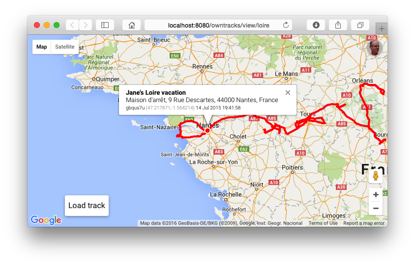

# OwnTracks Recorder


[](https://travis-ci.org/owntracks/recorder)

The _OwnTracks Recorder_ is a lightweight program for storing and accessing location data published via MQTT (or HTTP) by the [OwnTracks](http://owntracks.org) apps. It is a compiled program which is easily to install and operate even on low-end hardware, and it doesn't require an external database.



There are two main components: the _Recorder_ obtains data via MQTT subscribes or HTTP POST, stores the data in plain files and serve it via its built-in REST API, and the `ocat` command-line utility reads stored data in a variety of formats.

We developed the Recorder as a one-stop solution to storing location data published by our OwnTracks apps (iOS and Android) and retrieving this data. Our previous offerings (`m2s`, `o2s`/`Pista`) also work of course, but we believe the Recorder is best suited to most environments.

See also [HOOKS.md](https://github.com/owntracks/recorder/blob/master/doc/HOOKS.md), [DESIGN.md](https://github.com/owntracks/recorder/blob/master/doc/DESIGN.md), and [STORE.md](https://github.com/owntracks/recorder/blob/master/doc/STORE.md) for more information on Lua hooks, program design, and storage layout, respectively.

## Table of Contents

* [`recorder`](#recorder)
* [Installing](#installing)
  * [Packages](#packages)
    * [systemd service](#systemd-service)
  * [Docker](#docker)
  * [Building from source](#building-from-source)
    * [Prerequisites](#prerequisites)
    * [Building](#building)
* [Getting started](#getting-started)
* [`ot-recorder` options](#ot-recorder-options)
* [Configuration file](#configuration-file)
* [Reverse proxy](#reverse-proxy)
  * [nginx](#nginx)
  * [Apache](#apache)
* [The HTTP Server](#the-http-server)
  * [Example functionality](#example-functionality)
	* [Last position of a particular user](#last-position-of-a-particular-user)
	* [Display map with points starting at a particular date](#display-map-with-points-starting-at-a-particular-date)
	* [Display a track (a.k.a. linestring)](#display-a-track-aka-linestring)
	* [Tabular display](#tabular-display)
	* [Live map](#live-map)
* [`ocat`](#ocat)
  * [Environment](#environment)
  * [Examples](#examples)
	* [List users and devices](#list-users-and-devices)
	* [Show the last position reported by a user](#show-the-last-position-reported-by-a-user)
	* [What were the last 4 positions reported?](#what-were-the-last-4-positions-reported)
* [Reverse Geo](#reverse-geo)
  * [Precision](#precision)
  * [The geo cache](#the-geo-cache)
* [Monitoring](#monitoring)
* [Lua hooks](#lua-hooks)
* [Views](#views)
  * [view JSON](#view-json)
  * [Authentication](#authentication)
* [HTTP mode](#http-mode)
  * [Friends in HTTP mode](#friends-in-http-mode)
* [Advanced topics](#advanced-topics)
  * [Browser API keys](#browser-api-keys)
  * [The LMDB database](#the-lmdb-database)
    * [`topic2tid`](#topic2tid)
	* [`keys`](#keys)
	* [`friends`](#friends)
* [Encryption](#encryption)
* [Tips and Tricks](#tips-and-tricks)
  * [Gatewaying HTTP to MQTT](#gatewaying-http-to-mqtt)
  * [Override reverse-geo precision](#override-reverse-geo-precision)

## `recorder`

The Recorder serves two purposes:

1. It subscribes to an MQTT broker and reads messages published from the OwnTracks apps, storing these in a particular fashion into what we call the _store_ which is basically a bunch of plain files on the file system. Alternatively the Recorder can listen on HTTP for OwnTracks-type JSON messages POSTed to its HTTP server.
2. It provides a Web server which serves static pages, a REST API you use to request data from the store, and a WebSocket server. The distribution comes with a few examples of how to access the data through its HTTP interface (REST API). In particular a table of last locations has been made available as well as a live map which updates via the Recorder's WebSocket interface when location publishes are received. In addition we provide maps with last points or tracks using the GeoJSON produced by the Recorder.


## Installing

We provide ready-to-run packages for a limited number of platforms on our [package repository](http://repo.owntracks.org/README.txt), and we provide a Docker image which bundles the Recorder and a Mosquitto broker [directly from the Docker hub](https://hub.docker.com/r/owntracks/recorderd/).

If those don't work for you, you can build from source.

### Packages

We create packages for releases for a few distributions. Please note that these packages depend on libmosquitto1 from the [Mosquitto project](http://mosquitto.org/downloads).

Binaries (`ocat`, `ot-recorder`) from these packages run setuid to user `owntracks` so that they work for all users of the system. Note that, say, certificate files you provide must therefore also be readable by the user `owntracks`.

If you're on CentOS 7, you can install with:

```
sudo curl -o /etc/yum.repos.d/mosquitto.repo http://download.opensuse.org/repositories/home:/oojah:/mqtt/CentOS_CentOS-7/home:oojah:mqtt.repo

sudo curl -o /etc/yum.repos.d/owntracks.repo http://repo.owntracks.org/centos/owntracks.repo

sudo yum install ot-recorder
```

Debian 7 "Wheezy" (including Rasbian):

```
curl http://repo.owntracks.org/repo.owntracks.org.gpg.key | sudo apt-key add -
echo "deb  http://repo.owntracks.org/debian wheezy main" | sudo tee /etc/apt/sources.list.d/owntracks.list > /dev/null
sudo apt-get update
sudo apt-get install ot-recorder
```

Debian 8 "Jessie":

```
curl http://repo.owntracks.org/repo.owntracks.org.gpg.key | sudo apt-key add -
echo "deb  http://repo.owntracks.org/debian jessie main" | sudo tee /etc/apt/sources.list.d/owntracks.list > /dev/null
sudo apt-get update
sudo apt-get install libsodium-dev libsodium13
sudo apt-get install ot-recorder
```

Debian 9 "Stretch":

```
curl http://repo.owntracks.org/repo.owntracks.org.gpg.key | sudo apt-key add -
echo "deb  http://repo.owntracks.org/debian stretch main" | sudo tee /etc/apt/sources.list.d/owntracks.list > /dev/null
sudo apt-get update
sudo apt-get install ot-recorder
```

#### systemd service

The packages we provide have a systemd unit file in `/usr/share/doc/ot-recorder/ot-recorder.service` which you can use to have the Recorder started automatically:

1. Ensure you have a configuration file with the settings you require
2. `install -m444 /usr/share/doc/ot-recorder/ot-recorder.service /etc/systemd/system/ot-recorder.service`
3. Enable the service to run at startup: `systemctl enable ot-recorder`
4. Launch the service `systemctl start ot-recorder`


### Docker

We also have a Docker image to create containers which integrate a [Mosquitto broker](http://mosquitto.org) with the Recorder. The Docker image is [available from the Docker hub](https://hub.docker.com/r/owntracks/recorderd/) (e.g. `docker pull owntracks/recorderd`), and it's [usage is documented in the Booklet](http://owntracks.org/booklet/clients/recorder/).

### Building from source

#### Prerequisites

You will require:

* [libmosquitto](http://mosquitto.org) unless you disable MQTT during building, but see below for platform instructions
* [libCurl](http://curl.haxx.se/libcurl/)
* [lmdb](http://symas.com/mdb) (included)
* [libconfig](http://www.hyperrealm.com/libconfig/)
* Optionally [Lua](http://lua.org)
* Optionally [libsodium](https://github.com/jedisct1/libsodium) for secret-key encryption of payloads

You need a current version of libmosquitto (and you probably require the Mosquitto broker as well for OwnTracks). We strongly recommend installing Mosquitto either from [source](http://mosquitto.org/download/) or from a [binary package](http://mosquitto.org/download/), both of which are provided by the [Mosquitto project](http://mosquitto.org/). In particular, older or LTS OS versions profit from this.

On Debian, you can install the needed packages with:

```
apt-get install build-essential linux-headers-$(uname -r) libcurl4-openssl-dev libmosquitto-dev liblua5.2-dev libsodium-dev libconfig-dev
```

On CentOS 7:

```
yum groupinstall 'Development Tools'
yum install libmosquitto-devel libcurl-devel lua-devel libsodium-devel libconfig-devel
```

(libsodium is in epel-stable)

On Ubuntu:

```
sudo apt-add-repository ppa:mosquitto-dev/mosquitto-ppa
sudo apt-get update
sudo apt-get install libmosquitto-dev libcurl3 libcurl4-openssl-dev libconfig-dev
```

#### Building

1. Obtain and download the software, via [our Homebrew Tap](https://github.com/owntracks/homebrew-recorder) on Mac OS X, directly as a clone of the repository, or as a [tar ball](https://github.com/owntracks/recorder/releases) which you unpack.
2. Copy the included `config.mk.in` file to `config.mk` and edit that. You specify the features or tweaks you need. (The file is commented.) Pay particular attention to the installation directory and the value of the store (`STORAGEDEFAULT`): that is where the Recorder will store its files. `DOCROOT` is the root of the directory from which the Recorder's HTTP server will serve files.
3. Type `make` and watch the fun.

When `make` finishes, you should have at least two executable programs called `ot-recorder` which is the Recorder proper, and `ocat`. If you want you can install these using `make install`, but this is not necessary: the programs will run from whichever directory you like if you add `--doc-root ./docroot` to the Recorder options.

Ensure the LMDB databases are initialized by running the following command which is safe to do, also after an upgrade. (This initialization is non-destructive -- it will not delete any data.)

```
ot-recorder --initialize
```

## Getting started

The Recorder has, like `ocat`, a daunting number of options, most of which you will not require. Running either utility with the `-h` or `--help` switch will summarize their meanings. You can, for example launch with a specific storage directory, disable the HTTP server, change its port, etc.

If you require authentication or TLS to connect to your MQTT broker, pay attention to the `$OTR_` environment variables listed in the help.

Launch the Recorder:

```
$ ./ot-recorder 'owntracks/#'
```

(In HTTP mode, you do not have to specify a topic.)

Publish a location from your OwnTracks app and you should see the Recorder receive that on the console. If you haven't disabled Geo-lookups, you'll also see the address from which the publish originated.

The location message received by the Recorder will be written to storage. In particular you should verify that your storage directory contains:

1. a directory called `ghash/`
2. a directory called `rec/` with several subdirectories and a `.rec` file therein.
3. a directory called `last/` which contains subdirectories and a `.json` file therein.

When the Recorder has received a publish or two, visit it with your favorite Web browser by pointing your browser at `http://127.0.0.1:8083` or the address / port configured with the `--http-host` and `--http-port` options respectively.

Unless already provided by the package you installed, we recommend you create a shell script with which you hence-force launch the Recorder. Note that you can have it subscribe to multiple topics, and you can launch sundry instances of the Recorder (e.g. for distinct brokers) as long as you ensure:

* that each instance uses a distinct `--storage`
* that each instance uses a distinct `--http-port` (or `0` if you don't wish to provide HTTP support for a particular instance)

You also need to provide API keys for the maps.

### `ot-recorder` options

This section lists the most important options of the Recorder with their long names; check the usage (`recorder -h`) for the short versions.

`--clientid` specifies the MQTT client identifier to use upon connecting to the broker, thus overriding a constructed default. 

`--host` is the name or address of the MQTT broker and overrides `$OTR_HOST`. The default is "localhost". 

`--port` is the port number of the MQTT broker and overrides `$OTR_PORT`; it defaults to 1883. Setting this to 0 disables MQTT even if it is compiled-in.

`--identity` and `--psk` define the TLS PSK identity and preshared key respectively to use in a TLS-PSK connection to Mosquitto. Note that the listener needs to be set up accordingly and that it is an error to configure `--cafile` together with these options.

`--user` overrides `$OTR_USER` and specifies the username to use in the MQTT connection.

`--qos` specifies the MQTT QoS to use; it defaults to 2.

`--storagedir` is configured at build time and overrides `$OTR_STORAGEDIR`.

`--useretained` overrides the default of not consuming retained MQTT messages.

`--norec` disables writing of REC files, so no location history or other similar publishes are stored, and the Lua `otr_putrec()` function is not invoked even if it exists. What is stored are CARDS and PHOTOS, as well as the LAST location of a device. As such, the API's `/locations` endpoint becomes useless.

`--norevgeo` suppresses reverse geo lookups, but this means that historic data will not show addresses (e.g. with the API or with `ocat`). See below for information on Reverse Geo lookups.

`--logfacility` is the syslog facility to use (default is `LOCAL0`).

`--quiet` disables printing of messages to stdout.

`--initialize` creates the a structure within the storage directory and initializes the LMDB database. It is safe to use this even if such a database exists -- the database is not wiped. After initialization, Recorder exits.

`--label` specifies a label (default: "Recorder") to be shown in the WebSocket live map.

`--http-host` and `--http-port` define the listen address and port number for the API. If `--http-port` is 0, the Web server is disabled.

`--docroot` overrides the compile-time setting of the HTTP document root.

`--lua-script` specifies the path to the Lua script. If not given, Lua support is disabled.

`--precision` overrides the compiled-in default. (See "Precision" later.)

`--geokey` sets the Google API key for reverse geo lookups.  If you do more than 2500 (currently) reverse-geo requests per day, you'll need an API key for Google's geocoding service. Specify that here.

`--debug` enables a bit of additional debugging on stderr.

## Configuration file

The Recorder attempts to read its startup configuration from a configuration file; the path to this is compiled into the Recorder (typically `/etc/defaults/ot-recorder`, and `ocat -v` will display the compiled-in default). The format of this file approximates that of a shell script with variables to be exported (the intention is so that it can be sourced by a shell script). Lines beginning with an octothorp (`#`) are ignored as are blank lines. Configuration settings proper are set as follows (note that some older versions of libconfig require a trailing semicolon (`;`) at the end of a variable assignment):

```
OTR_STORAGEDIR="/var/spool/owntracks/recorder/store"
```

The following configuration settings may be applied (a `Y` in column `$` means an environment variable of the same name overrides a setting in the config file):

| Variable              |  $    | Default       | Usage
| --------------------- | :---  | :------------ | ---------------
| `OTR_STORAGEDIR`      |  Y    | compiled in   | Pathname to the storage directory
| `OTR_HOST`            |  Y    | `localhost`   | MQTT hostname/address to connect to
| `OTR_PORT`            |  Y    | `1883`        | MQTT port number to connect to
| `OTR_USER`            |  Y    |               | MQTT username
| `OTR_PASS`            |  Y    |               | MQTT password
| `OTR_QOS`             |       | `2`           | MQTT QoS
| `OTR_CLIENTID`        |       | hostname+pid  | MQTT ClientID (override with -i)
| `OTR_HTTPHOST`        |       | `localhost`   | Address for the HTTP module to bind to
| `OTR_HTTPPORT`        |       | `8083`        | Port number of the HTTP module to bind to
| `OTR_HTTPLOGDIR`      |       |               | Directory in which to store access.log. Override with --http-logdir
| `OTR_LUASCRIPT`       |       |               | Path to the Lua script
| `OTR_PRECISION`       |       | `7`           | Reverse-geo precision
| `OTR_GEOKEY`          |       |               | API key for reverse-geo lookups
| `OTR_BROWSERAPIKEY`   |  Y    |               | Google maps browser API key
| `OTR_TOPICS`          |       |               | String containing a space-separated list of topics to subscribe to for MQTT (overridden by command-line arguments)
| `OTR_CAFILE`          |  Y    |               | Path to PEM-encoded CA certificate file for MQTT (implicitly enables TLS)
| `OTR_CAPATH`          |  Y    |               | Directory of c_rehashed PEM certificates
| `OTR_CERTFILE`        |  Y    |               | Path to PEM-encoded client certificate
| `OTR_KEYFILE`         |  Y    |               | Path to PEM-encoded client key


Note that options passed to `ot-recorder` override both configuration file settings and environment variables.

## Reverse proxy

Running the Recorder protected by an Nginx or Apache server is possible and is the only recommended method if you want to serve data behind localhost. The snippets below show how to do it, but you would also add authentication to them - or at least, to everything but the views. The snippet for HTTP mode shows an example of how to do this.

### nginx

```
server {
    listen       8080;
    server_name  192.168.1.130;

    location / {
        root   html;
        index  index.html index.htm;
    }

    # Proxy and upgrade WebSocket connection
    location /owntracks/ws {
        rewrite ^/owntracks/(.*)    /$1 break;
        proxy_pass      http://127.0.0.1:8083;
        proxy_http_version  1.1;
        proxy_set_header    Upgrade $http_upgrade;
        proxy_set_header    Connection "upgrade";
        proxy_set_header    Host $host;
        proxy_set_header    X-Forwarded-For $proxy_add_x_forwarded_for;
    }

    location /owntracks/ {
        proxy_pass      http://127.0.0.1:8083/;
        proxy_http_version  1.1;
        proxy_set_header    Host $host;
        proxy_set_header    X-Forwarded-For $proxy_add_x_forwarded_for;
        proxy_set_header    X-Real-IP $remote_addr;
    }

    # OwnTracks Recorder Views
    location /owntracks/view/ {
         proxy_buffering         off;            # Chrome
         proxy_pass              http://127.0.0.1:8083/view/;
         proxy_http_version      1.1;
         proxy_set_header        Host $host;
         proxy_set_header        X-Forwarded-For $proxy_add_x_forwarded_for;
         proxy_set_header        X-Real-IP $remote_addr;
    }
    location /owntracks/static/ {
         proxy_pass              http://127.0.0.1:8083/static/;
         proxy_http_version      1.1;
         proxy_set_header        Host $host;
         proxy_set_header        X-Forwarded-For $proxy_add_x_forwarded_for;
         proxy_set_header        X-Real-IP $remote_addr;
    }

    # HTTP Mode
    location /owntracks/pub {
        auth_basic              "OwnTracks pub";
        auth_basic_user_file    /usr/local/etc/nginx/owntracks.htpasswd;
        proxy_pass              http://127.0.0.1:8083/pub;
        proxy_http_version      1.1;
        proxy_set_header        Host $host;
        proxy_set_header        X-Forwarded-For $proxy_add_x_forwarded_for;
        proxy_set_header        X-Real-IP $remote_addr;

        # Optionally force Recorder to use username from Basic
        # authentication user. Whether or not client sets
        # X-Limit-U and/or uses ?u= parameter, the user will
        # be set to $remote_user.
        proxy_set_header        X-Limit-U $remote_user;
    }
}
```

### Apache

This will hand URIs which begin with `/owntracks/` to the Recorder.

```

# WebSocket URL endpoint
# a2enmod proxy_wstunnel
ProxyPass        /owntracks/ws        ws://127.0.0.1:8083/ws keepalive=on retry=60
ProxyPassReverse /owntracks/ws        ws://127.0.0.1:8083/ws keepalive=on

# Static files
ProxyPass /owntracks                  http://127.0.0.1:8083/
ProxyPassReverse /owntracks           http://127.0.0.1:8083/

# TODO: add views
```

## The HTTP server

The Recorder has a built-in HTTP server with which it servers static files from either the compiled-in default `DOCROOT` directory or that specified at run-time with the `--doc-root` option. Furthermore, it serves JSON data from the API end-point at `/api/0/` and it has a built-in WebSocket server for the live map.

The API basically serves the same data as `ocat` is able to produce - see [API.md](https://github.com/owntracks/recorder/blob/master/API.md). The server also accepts OwnTracks app data via HTTP POST to the `/pub` endpoint.

### Example functionality

Some examples of what the server can do:

#### Last position of a particular user

Retrieve the last position of a particular user. In addition to the values obtained in the [`location` publish](http://owntracks.org/booklet/tech/json/) from the OwnTracks device, there are a few which we return as convenience:

* `username` contains the name of the user obtained from the publish topic
* `device` contains the user's device name as obtained from the publish topic
* `topic` is the full topic to which the payload was published
* `ghash` is the geohash string which corresponds to `lat` and `lon`
* `isotst` is the ISO timestamp of the publish time (`tst`)
* `disptst` is the same but designed for displaying
* `cc` is the country code of the location point if available in the cache (see below)
* `addr` is the address of the location point if available in the cache

```
$ curl http://127.0.0.2:8083/api/0/last -d user=demo -d device=iphone
[
 {
  "tst": 1440405601,
  "acc": 10,
  "_type": "location",
  "alt": 262,
  "lon": 13.60279820860699,
  "vac": 6,
  "vel": 18,
  "lat": 51.06263391678321,
  "cog": 82,
  "tid": "NE",
  "batt": 99,
  "username": "demo",
  "device": "iphone",
  "topic": "owntracks/demo/iphone",
  "ghash": "u31dmx9",
  "isotst": "2015-08-24T08:40:01Z",
  "disptst": "2015-08-24 08:40:01",
  "cc": "DE",
  "addr": "E40, 01156 Dresden, Germany"
 }
]
```

#### Display map with points starting at a particular date

By specifying a `format` we can produce GeoJSON, say. Normally, the API retrieves the last 6 hours of data but we can extend or limit this with the `from` and `to` parameters.

```
http://127.0.0.2:8083/map/index.html?user=demo&device=iphone&format=geojson&from=2014-01-01
```

In a suitable Web browser, the result is



#### Display a track (a.k.a linestring)

If we change the `format` parameter of the previous URL to `linestring`, the result is


#### Tabular display

The Recorder's Web server also provides a tabular display which shows the last position of devices, their address, country, etc. Some of the columns are sortable, you can search for users/devices and click on the address to have a map opened at the device's last location.


#### Live map

The Recorder's built-in WebSocket server updates a map as it receives publishes from the OwnTracks devices. Here's an example:



## `ocat`

`ocat` is a CLI query program for data stored by Recorder: it prints data from storage in a variety of output formats:

* JSON
* GeoJSON (points)
* GeoJSON (line string)
* CSV
* GPX
* XML
* raw (the lines contained in the REC file with ISO timestamp)
* payload (basically just the payload part from RAW)

The `ocat` utility accesses the store directly — it doesn't use the Recorder’s REST interface. `ocat` has a daunting number of options, some combinations of which make no sense at all.

Some example uses we consider useful:

* `ocat --list`
   show which users are in the store.
* `ocat --list --user jjolie`
   show devices for the specified user
* `ocat --user jjolie --device ipad`
   print JSON data for the user's device produced during the last 6 hours.
* `ocat --last`
    print the LAST position of all users, devices. Can be combined with `--user` and `--device`.
* `ocat ... --format csv`
   produces CSV. Limit the fields you want extracted with `--fields lat,lon,cc` for example.
* `ocat ... --format xml`
   produces XML. Limit the fields you want extracted with `--fields lat,lon,cc` for example.
```xml
<?xml version='1.0' encoding='UTF-8'?>
	<?xml-stylesheet type='text/xsl' href='owntracks.xsl'?>
<owntracks>
 <point>
  <tst>1440405601</tst>
  <acc>10.000000</acc>
  <alt>262</alt>
  <lon>13.602798</lon>
  <vac>6.000000</vac>
  <vel>18</vel>
  <lat>51.062634</lat>
  <cog>82</cog>
  <tid>NE</tid>
  <batt>99</batt>
  <username>demo</username>
  <device>iphone</device>
  <topic>owntracks/demo/iphone</topic>
  <ghash>u31dmx9</ghash>
  <isotst>2015-08-24T08:40:01Z</isotst>
  <disptst>2015-08-24 08:40:01</disptst>
  <cc>DE</cc>
  <addr>E40, 01156 Dresden, Germany</addr>
 </point>

</owntracks>
```
* `ocat ... --limit 10`
   prints data  for the current month, starting now and going backwards; only 10 locations will be printed. Generally, the `--limit` option reads the storage back to front which makes no sense in some combinations.

Specifying `--fields lat,tid,lon` will request just those JSON elements from the store. (Note that doing so with output GPX or GEOJSON could render those formats useless if, say, `lat` is missing in the list of fields.)

The `--from` and `--to` options allow you to specify a UTC date and/or timestamp from which respectively until which data will be read. By default, the last 6 hours of data are produced. If `--from` is not specified, it therefore defaults to "now minus 6 hours". If `--to` is not specified it defaults to "now". Dates and times must be specified as strings, and the following formats are recognized:

```
%Y-%m-%dT%H:%M:%S
%Y-%m-%dT%H:%M
%Y-%m-%dT%H
%Y-%m-%d
%Y-%m
```

The `--limit` option limits the output to the last specified number of records. This is a bit of an "expensive" operation because we search the `.rec` files backwards (i.e. from end to beginning). When using `--limit` the 6 hours mentioned earlier do not apply.

### Environment

The following environment variables control `ocat`'s behavior:

* `OCAT_FORMAT` can be set to the preferred output format. If unset, JSON is used. The `--format` option overrides this setting.
* `OCAT_USERNAME` can be set to the preferred username. The `--user` option overrides this environment variable.
* `OCAT_DEVICE` can be set to the preferred device name. The `--device` option overrides this environment variable.

### Examples

The Recorder has been running for a while, and the OwnTracks apps have published data. Let us have a look at some of this data.

#### List users and devices

We obtain a list of users from the store:

```
$ ocat --list
{
 "results": [
  "demo"
 ]
}
```

From which devices has user `demo` published data?

```
$ ocat --list --user demo
{
 "results": [
  "iphone"
 ]
}
```

#### Show the last position reported by a user

Where was `demo`'s iPhone last seen? (Omit `--user` and `--device` to get LAST for all users and devices.)

```
$ ocat --last --user demo --device iphone
[
 {
  "tst": 1440405601,
  "acc": 10,
  "_type": "location",
  "alt": 262,
  "lon": 13.60279820860699,
  "vac": 6,
  "vel": 18,
  "lat": 51.06263391678321,
  "cog": 82,
  "tid": "NE",
  "batt": 99,
  "username": "demo",
  "device": "iphone",
  "topic": "owntracks/demo/iphone",
  "ghash": "u31dmx9",
  "isotst": "2015-08-24T08:40:01Z",
  "disptst": "2015-08-24 08:40:01",
  "cc": "DE",
  "addr": "E40, 01156 Dresden, Germany"
 }
]
```

Several things worth mentioning:

* The returned data structure is an array of JSON objects; had we omitted specifying a particular device or even a particular user we would have obtained the last position of all this user's devices or all users' devices respectively.
* If you are familiar with the [JSON data reported by the OwnTracks apps](http://owntracks.org/booklet/tech/json/) you'll notice that this JSON contains more information: this is provided on the fly by `ocat` and the REST API, e.g. from the reverse-geo cache the Recorder maintains.

#### What were the last 4 positions reported?

We can limit the number of returned elements: Let's do this as CSV, and limit the fields we are given:

```
$ ocat --user demo --device iphone --limit 4 --format csv --fields isotst,vel,addr
isotst,vel,addr
2015-08-24T08:40:01Z,18,"E40, 01156 Dresden, Germany"
2015-08-24T08:35:01Z,40,"E40, 01723 Wilsdruff, Germany"
2015-08-24T08:30:00Z,50,"A14, 01683 Nossen, Germany"
2015-08-24T08:24:59Z,40,"A14, 04741 Roßwein, Germany"
```

## Reverse Geo

If not disabled with option `--norevgeo`, the Recorder will attempt to perform a reverse-geo lookup on the location coordinates it obtains. These can be either

1. obtained via a Lua function you define (see [doc/HOOKS.md](doc/HOOKS.md))
2. obtained via a call to Google

Lookups performed via Google are stored in an LMDB database. If a lookup is not possible, for example because you're over quota, the service isn't available, etc., Recorder keeps tracks of the coordinates which could *not* be resolved in a file named `missing`:

```
$ cat store/ghash/missing
u0tfsr3 48.292223 8.274535
u0m97hc 46.652733 7.868803
...
```

This can be used to subsequently obtain missed lookups.

We recommend you keep reverse-geo lookups enabled, this data (country code `cc`, and the locations address `addr`) is used by the example Web apps provided by the Recorder to show where a particular device is. In addition, this cached data is used the the API (also `ocat`) when printing location data.

### Precision

The precision with which reverse-geo lookups are performed is controlled with the `--precision` option to Recorder (and with the `--precision` option to `ocat` when you query for data). The default precision is compiled into the code (from `config.mk`). The higher the number, the more frequently lookups are performed; conversely, the lower the number, the fewer lookups are performed. For example, a precision of 1 means that points within an area of approximately 5000 km^2 would resolve to a single address, whereas a precision of 7 means that points within an area of approximately 150 m^2 resolve to one address. The Recorder obtains a location publish, extracts the latitude and longitude, and then calculates the [geohash](https://en.wikipedia.org/wiki/Geohash) string and truncates it to `precision`. If the calculated geohash string can be found in our local LMDB cache, we consider the point cached; otherwise an actual reverse geo lookup (via HTTP) is performed and the result is cached in LMDB at the key of the geohash.

As an example, let's assume Jane's device is at position (lat, lon) `48.879840, 2.323522`, which resolves to a geohash string of length 7 `u09whf7`. We can [visualize this](http://www.movable-type.co.uk/scripts/geohash.html) and show what this looks like. (See also: [visualizing geohash](http://www.bigdatamodeling.org/2013/01/intuitive-geohash.html).)



Every location publish outside that very small blue square would mean another lookup. If, however, we lower the precision to, say, 5, a much larger area is covered



and a precision of 2 would mean that a very large part of France resolves to a single address:



The bottom line: if you run the Recorder with just a few devices and want to know quite exactly where you've been, use a high precision (7 is probably good). If you, on the other hand, run Recorder with many devices and are only interested in where a device was approximately, lower the precision; this also has the effect that fewer reverse-geo lookups will be performed in the Google infrastructure. (Also: respect their quotas!)

### The geo cache

As hinted to above, the address data obtained through a reverse-geo lookup is stored in an embedded LMDB database, the content of which we can look at with

```
$ ocat --dump
u09whf7 {"cc":"FR","addr":"1 Rue de Saint-Pétersbourg, 75008 Paris, France","tst":1445435622,"locality":"Paris"}
u09ey1r {"cc":"FR","addr":"D83, 91590 La Ferté-Alais, France","tst":1445435679,"locality":"La Ferté-Alais"}
```

The key to this data is the geohash string (here with an example of precision 2).

## Lua hooks

You can customize Recorder's behavior with Lua hooks. See [HOOKS.md](https://github.com/owntracks/recorder/blob/master/doc/HOOKS.md).

## Monitoring

In order to monitor the Recorder, whenever an MQTT message is received, a `monitor` file located relative to STORAGEDEFAULT is maintained. It contains a single line of text: the epoch timestamp and the last received topic separated from each other by a space.

```
1439738692 owntracks/jjolie/ipad
```


If Recorder is built with `WITH_PING` (default), a location publish to `owntracks/ping/ping` (i.e. username is `ping` and device is `ping`) can be used to round-trip-test the Recorder. For this particular username/device combination, Recorder will store LAST position, but it will not keep a `.REC` file for it. This can be used to verify, say, via your favorite monitoring system, that the Recorder is still operational.

After sending a pingping, you can query the REST interface to determine the difference in time. The `contrib/` directory has an example Python program (`ot-ping.py`) which you can adapt as needed for use by Icinga or Nagios.

```
OK ot-recorder pingping at http://127.0.0.1:8085: 0 seconds difference
```

Note that our Docker image has this monitoring built in with recorder-health.sh. What this basically does is it allows Docker to monitor the Recorder's availability in HEALTHCHECK. So, the `ping/ping` you may be seeing is being used between Docker and the container running the Recorder and has absolutely no impact on mobile data.

## Views

A view is a sort of sandboxed look at data provided by the Recorder. Assume you host several devices, be they your own or those of some of your friends, and assume you want to allow somebody else to see where you are or have been during a specific time frame: with the Recorder's default Web server you cannot limit a visitor to see specific data only; once they reach the Recorder's Web interface, they have access to all your data. (We warned you about that earlier.) Using a HTTP proxy, you can provide an insight into certain portions of your data only.

You configure a view by creating a small JSON file of an arbitrary name which defines which user / device combination of data the view should display. Say you are recording data for `owntracks/jjolie/phone`, the user would be `jjolie` and the device is `phone`. You can also create a specific HTML page for this view or just use the default `vmap.html` we provide.

The view then provides three URLs:

* `views/viewname` can serve a HTML or text page
* `views/viewname?lastpos=1` serves a JSON array of objects with the last position recorded
* `views/viewname?geodata=1` serves a GeoJSON object containing recorded track data

Suppose Jane wishes to have her acquaintances see where she is while on vacation. Jane knows she'll be en-route between 2015-06-29 and 2015-07-15. She creates a file called, say, `loire.json` in the `views/` directory of the Recorder's document root:

```json
{
  "user"  : "jjolie",
  "device": "phone",
  "page"  : "vmap.html",
  "from"  : "2015-06-29",
  "to"    : "2015-07-15"
}
```

Jane's friends can now visit the URL `/view/loire` (note the missing `.json` extension) to be served a map showing Jane's progress along the Loire valley (if that is where she's actually traveling through). Jane can keep that view up even after she returns because the view will not serve data after the 15th of July, in other words, her location at any other time before or after the from/to dates is hidden.



It's recommended that you configure your reverse proxy to show views. You can find an example of this for nginx in the [reverse proxy](#reverse-proxy) section.

### view JSON

The JSON in the view file (called `view.json` here) contains mandatory and optional elements:

| element         |  mandatory  | meaning                               |
| ----------------| :---------: | ------------------------------------- |
| user            |      Y      | username for data (from topic owntracks/user/device       |
| device          |      Y      | device for data (from topic owntracks/user/device       |
| page            |      Y      | HTML page to be loaded from `docroot/views/` for this view |
| from            |      N      | `from` timestamp for data, defaults to now - 6H |
| to              |      N      | `to` timestamp for data, defaults to now  |
| hours           |      N      | number of past hours (from "now") for which to show data; use instead of `from` and `to` 
| auth            |      N      | array of digest authentication tokens described below |
| label           |      N      | text to use in popup of default `vmap.html` instead of user/device |
| zoom            |      N      | zoom level for map used in `vmap.html`, defaults to 9 |
| *               |      N      | any other element is copied into the data returned |


The `page` is a single HTML file which must be located in the `views/` directory of the Recorder's document root. Trivial (primitive actually) text substitution is done for the following two tokens:

* `@@@LASTPOS@@@` is converted to a URI on which the Recorder will serve the last position data
* `@@@GEO@@@` is converted to a URI on which the Recorder will serve GeoJSON data from its storage.

The default `page` we provide is called `vmap.html`; by default it refreshes the last position every 60 seconds, and clicking on "Load track" loads the GeoJSON track for the time frame specified by `from` and `to`.



A little bit more complex view would look like this:

```json
{
  "config": {
    "port": 9001,
    "pathname": "/tmp/somewhere"
  },
  "zoom": 7,
  "label": "Jane's Loire vacation",
  "to": "2015-07-15",
  "from": "2015-06-29",
  "device": "phone",
  "user": "jjolie",
  "page": "vmap.html"
}
```

All JSON elements are copied into the `lastpos` data which is returned to the caller. Using the above view configuration, a user requesting `http://localhost:8083/view/loire?lastpos=1` would obtain

```json
{
 "data": [
  {
   "_type": "location",
   "cc": "FR",
   "lon": -1.564214,
   "lat": 47.217871,
   "alt": 35,
   "vel": 0,
   "t": "L",
   "cog": 0,
   "tid": "K2",
   "tst": 1436895718,
   "ghash": "gbqus7u",
   "addr": "Maison d'arrêt, 9 Rue Descartes, 44000 Nantes, France",
   "locality": "Nantes",
   "isorcv": "2015-07-14T19:41:58Z",
   "isotst": "2015-07-14T17:41:58Z",
   "disptst": "2015-07-14 17:41:58",
   "page": "vmap.html",
   "user": "jjolie",
   "device": "phone",
   "from": "2015-06-29",
   "to": "2015-07-15",
   "label": "Jane's Loire vacation",
   "zoom": 7,
   "pathname": "/tmp/somewhere",
   "port": 9001
  }
 ]
}
```

Note how `pathname` and `port` have been copied into the object. These values can be used by the `page` served in the view.

### Authentication

If `view.json` contains an element called `auth`, it is assumed to be an array of strings, each of which are a 32-character [Digest authentication](https://en.wikipedia.org/wiki/Digest_access_authentication) SHA1 strings for the realm `owntracks-recorder`, for example:

```json
"auth" : [ "225544f9acf99d18a8880c5ce844f303", "ba69e267302a7ef98e0862b9aae68cab" ]
```

Each user/password digest combination will be able to access the view.

You create these strings with, say, the `htdigest` program or `contrib/new-view-auth.py`:

```bash
htdigest -c /tmp/dd owntracks-recorder jjolie
Adding password for jjolie in realm owntracks-recorder.
New password:
Re-type new password:

cat /tmp/dd
jjolie:owntracks-recorder:225544f9acf99d18a8880c5ce844f303
```

In the above example, you copy the 32-character digest into your `view.json`, whereas in the following example, we create a template for you which you copy into your view.

```bash
./new-view-auth.py jjolie
Enter password for user jjolie:
Re-enter password:
"auth" : [ "225544f9acf99d18a8880c5ce844f303" ]
```


## HTTP mode

If enabled at compile time (`WITH_HTTP`), the Recorder will accept OwnTracks-type JSON payloads via HTTP at the URL endpoint `/pub&u=username&d=device`. You specify the username with the `u` parameter and the device name with the `d` parameter. (Alternatively you can provide `X-Limit-U` and `X-Limit-D` as headers with the username and device name respectively.) If unspecified, the username defaults to `owntracks` and the device to `phone`. For example:

```
curl --data "${payload}" 'http://127.0.0.1:8085/pub?u=jane&d=3s'
curl -H 'X-Limit-U: jane' -H 'X-Limit-D: 3s' --data "${payload}" 'http://127.0.0.1:8085/pub'
```

The content of the request is used by the Recorder as though it had arrived as an MQTT message; Lua hooks and WebSocket pushes are handled accordingly.

### Friends in HTTP mode

When a device posts a location request in HTTP mode, the endpoint may return a JSON array of OwnTracks objects of which `_type`s `cmd`, `location` and `card` may be supported by the device. This allows the device to see, say, friends. The Recorder has built-in support for this with the named "friends" lmdb database.
Assuming the following content of the friends database

```
$ ocat -S JP --dump=friends
jane-phone ["john/android", "jane/phone"]
```

when user `jane` and device `phone` POST a new location via HTTP, the Recorder will present John's data as the following payload to the device, assuming John has a card and last published this location:

```json
[
 {
  "_type": "card",
  "tid": "JA",
  "face": "/9j/4AAQSkZJR...",
  "name": "John Doe"
 },
 {
  "_type": "location",
  "tid": "JA",
  "lat": 48.95833,
  "lon": 2.39523,
  "tst": 1456212791
 }
]
```

Note, that Jane's user/device tuple should also be returned in order to display Jane on the map or list of friends in the apps.

## Advanced topics

### Browser API keys

By default, the Recorder uses [OpenStreetMap](https://www.openstreetmap.org) to view points and tracks.

In order to use Google Maps, you have to obtain a [Google API "Browser key"](https://developers.google.com/maps/documentation/javascript/get-api-key). You then pass this key to your Recorder by configuring it in the defaults configuration file or by overriding that with the option:

```bash
$ ot-recorder --browser-apikey 'xxxxxxxxxxxxxxxxxxxxxxxxxxxxxxxxxxxxxxx' ...
```


### The LMDB database

`ocat --load` and `ocat --dump` can be use to load and dump the LMDB database respectively. There is some support for loading/dumping named databases using `--load=xx` or `--dump=xx` to specify the name. Use the mdb utilities to actually perform backups of these. `--load` expects key/value strings in pairs, separated by exactly one space. If the value is the string `DELETE`, the key is deleted from the database, which allows us to, say, remove a whole bunch of geohash prefixes in one go (but be careful doing this):

```bash
ocat --dump |
    grep xxyz |
    awk '{printf "%s DELETE\n", $1; }' |
    ocat --load
```

#### `topic2tid`

This named lmdb database is keyed on topic name (`owntracks/jane/phone`). If the topic of an incoming message is found in the database, the `tid` member in the JSON payload is replaced by the string value of this key.

#### `keys`

If the Recorder was built with encryption support (see below), this named database contains the secret decryption keys for users/device pairs. The LMDB key is the username followed by a dash followed by the device name, all lower case, with spaces translated to a single dash. For example, if user Jjolie with device iPhone needs a secret entered, the database key will be `jjolie-iphone`. This can be entered into the database as follows:

```bash
echo "jjolie-iphone s3cr1t" | ocat --load=keys
```

Beware: these secret keys are stored in plain text so the database must be protected!

#### `friends`

For http mode, the `friends` named LMDB database contains lists of "friends" on a per user-device key. The key's value must be a valid JSON array of strings, each in the form `"user:device"` or `"user/device"` which indicate which locations a particular user may see. For example, when a user called `jane` on device `phone` publishes in http mode and she should be permitted to see where `john` / `android` is, we add the following key/value to the friends named database:

```bash
ocat --load=friends <<EOF
jane-phone [ "john/android" ]
EOF
```

The user/device separator in the array's strings may be a slash (`/`), a dash (`-`), or a colon (`:`).

## Encryption

If compiled with `WITH_ENCRYPT` support (this is the default in our packages), the Recorder will handle messages from OwnTracks [devices which support payload encryption](http://owntracks.org/booklet/features/encrypt/). Each user / device requires a secret key which is configured on the device and which must be configured on the Recorder host in order for the Recorder to be able to decrypt the payloads.

Upon successful decryption, the Recorder processes the original (device-transmitted) JSON and stores the result in plain (i.e. un-encrypted) form in the store, adding a `"_decrypted":true` tag to the JSON.

## Tips and Tricks

### Gatewaying HTTP to MQTT

It actually is possible to gateway location publishes arriving via HTTP into MQTT, though you should be careful not to create loops. You can accomplish this with one or more Lua hooks using MQTT from within Lua.

### Override reverse-geo precision

If a payload is received with an element called `_geoprec` it contains an override for the Recorder's configured reverse-geo precision. So, for example, if Recorder is running with precision 7, say, and the received payload contains `"_geoprec" : 2` the 2 will be used for this particular publish. This is not used in the OwnTracks apps, but it can be used with payloads you generate otherwise. If `_geoprec` is negative, new reverse geo lookups will not be performed, but cached entries of `abs(_geoprec)` will be used.

